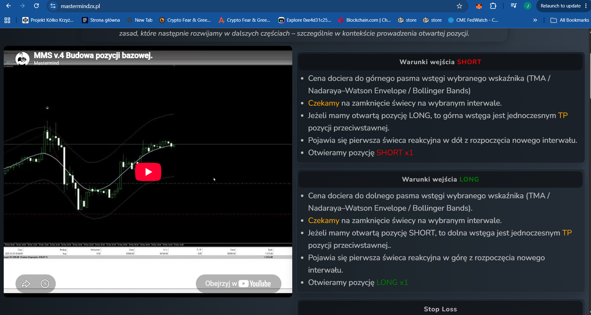
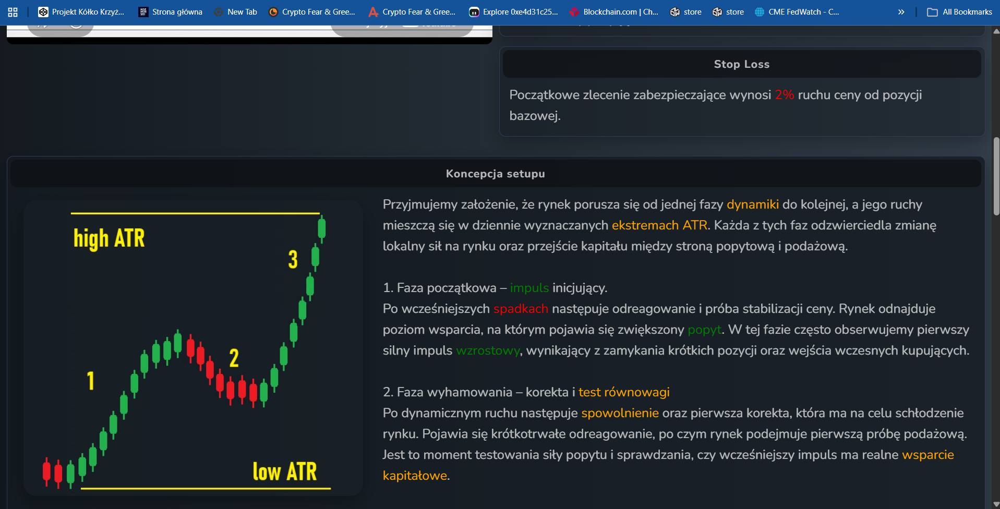
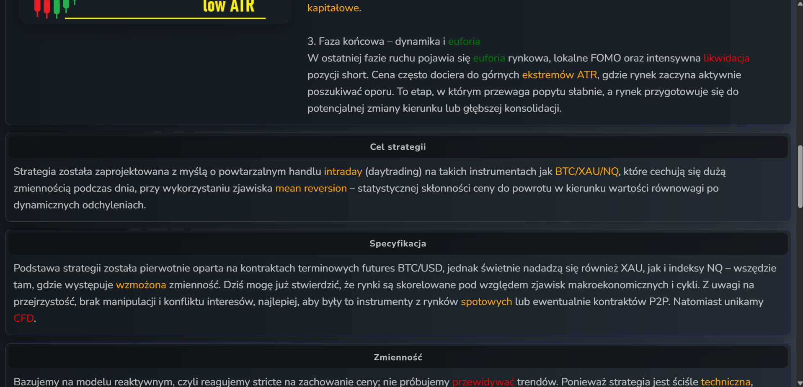
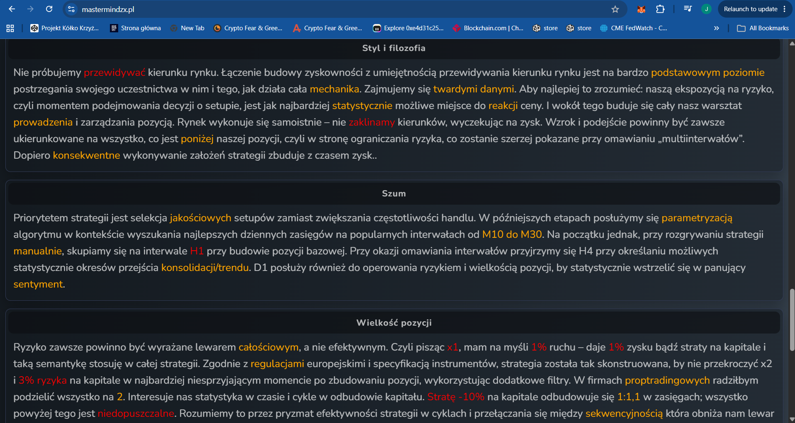

# MMS — Budowa pozycji bazowej (Base position building)

**Source:** Mastermind ZX (mastermindzx.pl) — MMS-BTC/XAU/NQ Mean-Reversion Contrarian
Strategy. **Extracted:** 2026-07-11 (live site text; cross-check vs `raw/` screenshots).
**Relevance to algo_bot:** HIGH — this tab defines the base entry/exit rules that
`mean_reversion_bb_stoch` implements (band touch → reaction candle → entry; TP =
opposite band; fixed 2% SL).

## Key rules (own words)

- **SHORT entry:** price reaches the *upper* band of the chosen envelope indicator
  (TMA / Nadaraya–Watson Envelope / Bollinger Bands). Wait for the candle to **close**
  on the chosen interval. Entry happens on the **first reaction candle downward at the
  start of a new interval**. Open SHORT at x1.
- **LONG entry:** mirror image — *lower* band touch, candle close, first reaction
  candle upward from the new interval, open LONG x1.
- **TP is the opposite band:** if a LONG is open, the upper band is simultaneously the
  TP of that position (and the arming level for the opposite SHORT); symmetric for
  SHORT/lower band. The setup "ends and begins" at the bands — position flow is
  band-to-band.
- **Initial SL = 2% price move** from the base position. Mandatory on every setup.
- **No trailing stops.** Explicitly rejected — the author states their own algorithmic
  parametrization showed worse results with trailing; the edge is catching the best
  daily-ATR-scale deviations, not fixed R:R management.
- **Reactive, not predictive:** the strategy never forecasts direction; exposure is
  taken at the statistically most probable reaction spot (band = daily-ATR-scale
  extreme). Decisions are binary ("zerojedynkowe") off the chart.
- **Quality over frequency:** setup selection beats trade frequency. The setup "comes
  to you" — no forcing setups after volatility has been spent.
- **Strong-trend filter lives elsewhere:** the protection against fighting strong
  trends is *not* in the entry rules — it is the sequentiality / position-sizing layer
  (tab 3), which effectively switches the strategy off in strong trends.

## Key parameters

| Parameter | MMS value | Note |
|---|---|---|
| Envelope indicator | TMA / NW Envelope / **BB** — interchangeable | "Settings currently completely irrelevant — parametrization decides"; standard settings as default |
| Confirmation oscillator | **Stochastic** | Framed as filter for *position build-out* (rozbudowa), i.e. adding to the position — not strictly the base entry |
| Initial SL | **2%** price move from base entry | Flat percent, not ATR-scaled |
| TP | Opposite band | Simultaneously the arming level of the reverse setup |
| Base size | **x1** total leverage | Semantics: x1 ⇒ 1% price move = 1% equity PnL; strategy designed to never exceed x2 / 3% equity risk at the worst point |
| Manual TF | **H1** for base position | H4 = consolidation/trend transition statistics; D1 = risk & position sizing vs daily sentiment |
| Algo TF | **M10–M30** | Parametrization target range for best daily-range capture ("popularne interwały od M10 do M30") |
| Instruments | BTC / XAU / NQ futures (spot or P2P derivatives; avoid CFD) | High intraday volatility required |

## Screenshots

Full-tab captures (2026-07-11), cross-checked against live site text — identical:

Caption: entry conditions for both directions — band touch, wait for candle close,
first reaction candle from the new interval, open x1. Upper band = TP of an open LONG
(and vice versa).

Caption: initial SL = 2% price move from base position; setup concept diagram — market
moves phase-to-phase (initiating impulse → deceleration/test → euphoria) inside
daily-ATR extremes ("high ATR" / "low ATR" rails).

Caption (04-06): reactive-not-predictive philosophy; TF split (manual H1 base, algo
M10-M30, H4 consolidation/trend statistics, D1 risk); x1 leverage semantics with x2 /
3% equity hard cap and sequential de-leveraging to x0.1 after losses; indicator
interchangeability (TMA/NW/BB) + Stochastic as build-out confirmation filter; SL
mandatory, no trailing (parametrization showed worse results), no fixed R:R frame.

## Alignment relevance (→ strategy-mean-reversion-bb-stoch.md)

- **Band touch → wait for close → first reaction candle → entry**: Beta implements
  exactly this as armed → reaction state machine on closed bars. Match: **Y**.
- **TP = opposite live band**: Beta `tp_band` uses the live opposite band. Match: **Y**.
- **Fixed 2% SL, no trail/BE/timeout**: Beta `sl_pct=0.02` fixed, bare core. Match: **Y**.
- **Indicator choice BB (vs TMA/NW)**: MMS treats the envelope as interchangeable and
  settings as parametrization targets; Beta picked BB (mainstream, in `core.py`).
  Divergence rationale: sanctioned by MMS itself. Match: **Y (within MMS freedom)**.
- **Stochastic as base-entry gate (`entry_mode=bb_stoch`)**: MMS frames Stochastic as a
  confirmation filter for *building out* the position (pyramiding), not the base entry.
  Beta uses it as an optional base-entry gate (sweep dimension). Match: **PARTIAL** —
  divergence to be examined in the alignment table; base position build-out (pyramiding)
  itself is the deferred edge (separate ADR).
- **x1 sizing / max x2 / sequential leverage x0.1**: not implemented in Beta (deferred
  with pyramiding). Match: **N (deferred by design)**.
