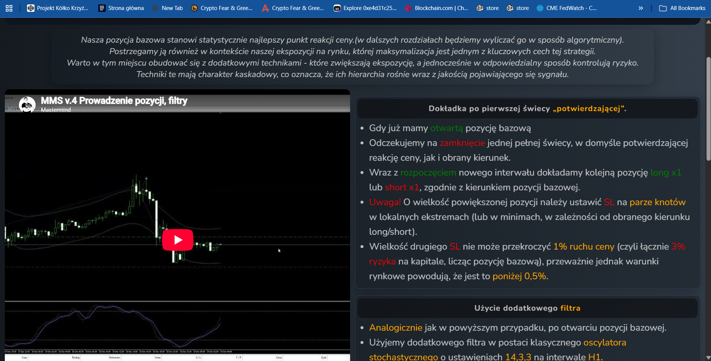
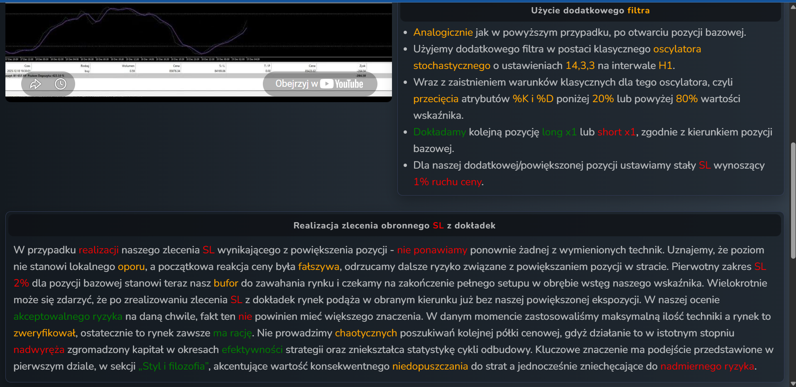
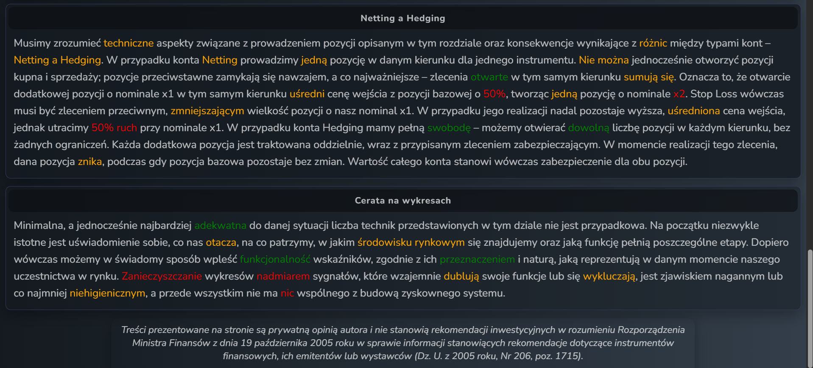

# MMS — Prowadzenie pozycji, filtry (Position management, filters)

**Source:** Mastermind ZX (mastermindzx.pl) — MMS-BTC/XAU/NQ Mean-Reversion Contrarian
Strategy v.4. **Extracted:** 2026-07-11 (full-tab screenshots in `raw/`).
**Relevance to algo_bot:** HIGH — defines the *scale-in (dokładka)* mechanics and the
actual role of the Stochastic oscillator in the methodology. Directly informs the
`entry_mode` divergence analysis and the deferred pyramiding ADR.

## Key rules (own words)

- **Base position = the statistically best reaction point**; the methodology's key
  trait is *maximising exposure around it* with additional, cascading techniques —
  their hierarchy rises with the quality of the incoming signal.
- **Trigger A — after the first confirming candle:** with the base position open, wait
  for one full candle to close (confirming the reaction and direction). At the **start
  of the new interval add another x1** in the base direction.
- **Add-on SL placement:** for the enlarged position, SL goes at the **pair of wicks at
  the local extremes** (minima for long / maxima for short). The add-on's SL may not
  exceed **1% price move** (total risk incl. base ≤ **3% equity**); market conditions
  usually keep it **below 0.5%**.
- **Trigger B — Stochastic filter:** an alternative add-on trigger using the **classic
  Stochastic 14,3,3 on H1**. Condition = the classic oscillator signal: **%K and %D
  cross below 20 or above 80**. Add x1 in the base direction; the add-on gets a fixed
  SL of **1% price move**.
- **Add-on SL hit → stand down:** if an add-on's SL fires, none of the techniques are
  repeated — the level is judged *not* a local support and the initial reaction false.
  The base position's original 2% SL becomes the buffer; wait for the setup to complete
  within the bands. No chaotic hunting for the next price shelf — it erodes capital
  accumulated in the strategy's effective periods and distorts recovery-cycle stats.
- **Netting vs hedging accounts matter for mechanics:** on a netting account an extra
  x1 in the same direction averages the entry 50% toward the add-on price into a single
  x2 position, and its "SL" must be an opposite *reduce-by-x1* order; on a hedging
  account each add-on is an independent position with its own protective order (add-on
  dies, base survives).
- **Chart hygiene ("cerata"):** the number of techniques is deliberately minimal;
  signal-duplicating indicator clutter is explicitly condemned.

## Key parameters

| Parameter | MMS value | Note |
|---|---|---|
| Add-on trigger A | Close of the first full confirming candle → add at new interval open | Time/price-action based, no indicator |
| Add-on trigger B | Stochastic **14/3/3 on H1**, **%K & %D** cross < 20 or > 80 | The oscillator's ONLY explicit role in MMS |
| Add-on size | x1 (same as base) | Total ≤ x2 by construction |
| Add-on SL | wick-pair local extreme, ≤ 1% move (typically < 0.5%) | Base keeps its 2% SL as buffer |
| Total risk cap | 3% equity at worst point | Base 2% + add-on ≤ 1% |
| After add-on SL | No re-adds, base rides to band TP or 2% SL | Anti-chaos rule |

## Screenshots

Caption: cascading add-on techniques over the base position; confirming-candle trigger rules and the
1%-move SL cap (3% total risk).

Caption: Stochastic 14/3/3 H1 as the add-on filter (%K & %D cross 20/80); stand-down
rule after an add-on SL hit.

Caption: netting-vs-hedging execution mechanics for add-ons; chart-hygiene philosophy.

## Alignment relevance

- **Stochastic role — key divergence.** MMS: Stochastic 14/3/3 (H1) gates the
  *add-on* (pyramiding), classic signal = %K & %D cross of 20/80, applied while a
  position is already open. Beta `mean_reversion_bb_stoch`: Stochastic gates the *base
  entry* at arming (`entry_mode="bb_stoch"`), `%K`-only threshold, no %D, no cross.
  Match: **N — deliberate adaptation**: Beta has no pyramiding (deferred ADR), so the
  oscillator was repurposed as an optional base-entry quality filter and made a sweep
  dimension (`bb_only` vs `bb_stoch`) to be resolved empirically in MR-Session 2.
- **Add-on mechanics (one add-on, trigger A/B, wick-pair SL, 3% cap, netting/hedging):** not
  implemented in Beta — this whole tab is the deferred pyramiding edge. Match: **N
  (deferred by design; single-position backtesting.py cannot express it).**
- **Stochastic default 14/3/3 and thresholds 20/80:** adopted verbatim as Beta
  defaults / frozen prior in `config/mr_b1.yaml`. Match: **Y**.
- **H1 as the reference TF for the oscillator:** consistent with `mr_b1/b2`
  `__implied_tf: "1h"`. Match: **Y**.
