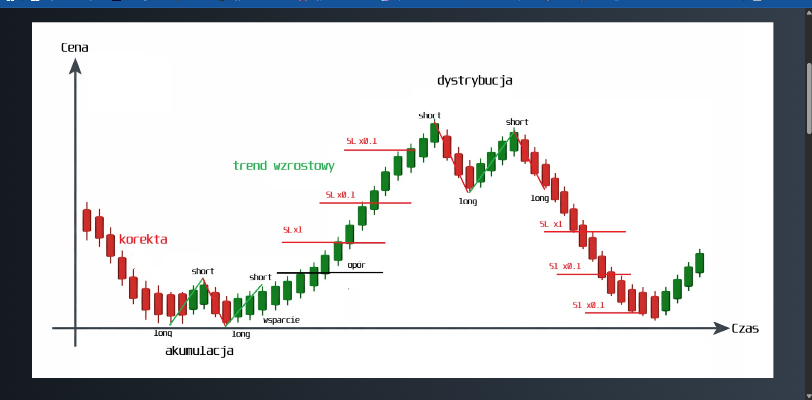
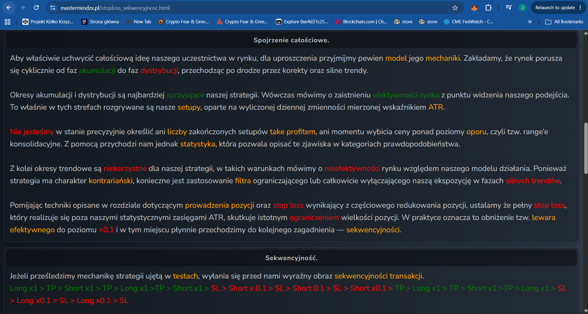
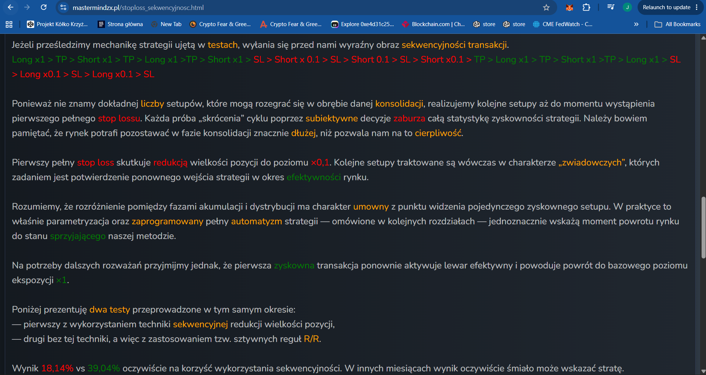
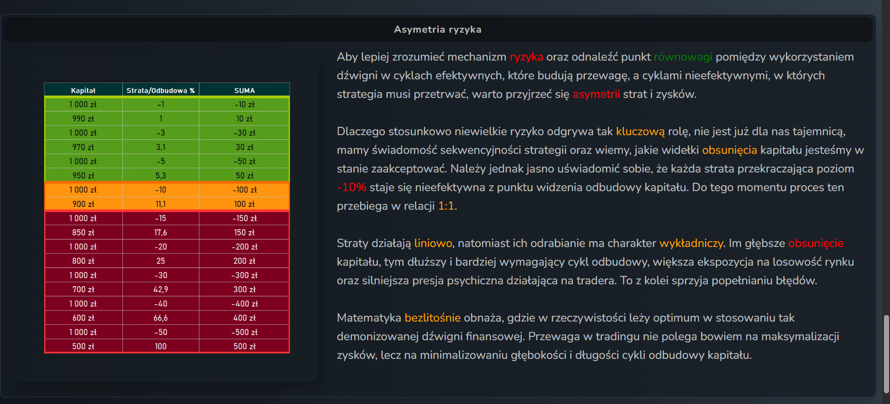

# MMS — Stop loss, sekwencyjność (Stop loss, sequentiality)

**Source:** Mastermind ZX (mastermindzx.pl/stoploss_sekwencyjnosc.html) —
MMS-BTC/XAU/NQ Mean-Reversion Contrarian Strategy v.4.
**Extracted:** 2026-07-11 (full-tab screenshots in `raw/`).
**Relevance to algo_bot:** HIGH — **this tab is Mastermind's actual claimed edge**
(sequential leverage reduction as the strong-trend filter), explicitly deferred from
the Beta implementation to a separate ADR. Extracted in maximum detail as the primary
input for that future ADR.

## Key rules (own words)

- **Cycle model:** the market moves cyclically accumulation → distribution, passing
  through corrections and strong trends. Accumulation/distribution (consolidation)
  phases = *market efficiency* for this model — that is where the setups play out,
  based on daily volatility measured with ATR. Trend phases = *inefficiency*.
- **The strong-trend filter is not a signal filter — it is position sizing.** Because
  the strategy is contrarian, exposure must be limited or disabled in strong trends.
  The mechanism: a **full stop loss** (one realized beyond the statistical daily-ATR
  ranges) triggers a hard reduction of position size — **effective leverage drops to
  x0.1**.
- **Sequentiality:** the number of setups inside a consolidation is unknowable, so
  successive setups are played **until the first full SL**. Any subjective "shortening"
  of the cycle distorts the strategy's profitability statistics (consolidations can
  outlast patience).
- **Scout trades:** after the first full SL, subsequent setups at x0.1 act as
  *scouts* whose only job is to confirm the market's return to an efficient state.
- **Re-arming:** the first **profitable** trade re-activates the effective leverage —
  size returns to the base x1. (The author notes the accumulation-vs-distribution
  distinction is conventional; the *parametrized, fully automated* strategy is what
  ultimately marks the return of a favorable regime.)
- **Sequence example (verbatim pattern from the tab):**
  `Long x1 > TP > Short x1 > TP > Long x1 > TP > Short x1 > SL > Short x0.1 > SL >
  Short x0.1 > SL > Short x0.1 > TP > Long x1 > TP > Short x1 > TP > Long x1 > SL >
  Long x0.1 > SL > Long x0.1 > SL`
  — note: after a full SL the *same-direction* setups continue at x0.1; a TP anywhere
  restores x1.
- **Evidence cited by the author:** two backtests over the same period — with
  sequential reduction vs without (fixed R/R rules) — quoted as **18.14% vs 39.04%**
  "in favour of sequentiality". ⚠️ Ambiguity: the sentence lists the sequential test
  first, which pairs 18.14% with sequencing — consistent with "in favour" only if the
  figure is a *drawdown/loss-side* metric (18.14% shown in red, 39.04% in green in the
  screenshot). Treat the exact metric as unresolved; the qualitative claim is
  "sequencing materially improves the same-period result". The author adds that in
  other months the non-sequential variant can outright lose.
- **Risk asymmetry as the design rationale:** losses are linear, recovery is
  exponential. Up to **-10%** equity the loss↔recovery relation is treated as ~1:1
  (-10% needs +11.1%); anything deeper is "inefficient for capital recovery"
  (-20%→+25%, -30%→+42.9%, -50%→+100%). The edge is defined as **minimising the depth
  and length of recovery cycles**, not maximising profits.

## Key parameters

| Parameter | MMS value | Note |
|---|---|---|
| Full-SL leverage reduction | x1 → **x0.1** | Triggered by the first full (2%) SL beyond ATR ranges |
| Scout size | x0.1 | Until first profitable trade |
| Re-arm to x1 | First profitable trade (TP) | Working assumption stated by the author |
| Max acceptable equity drawdown | **-10%** | Beyond it recovery is declared inefficient (1:1 rule breaks) |
| Cycle discipline | Play every setup until first full SL | No discretionary cycle-shortening |

## Screenshots

Caption: the cycle diagram — contrarian long/short setups inside
accumulation/distribution; in the strong uptrend the failed shorts step down SL x1 →
SL x0.1; support/resistance rails mark the consolidation ranges.

Caption: efficiency/inefficiency framing; full SL beyond ATR ranges → effective
leverage x0.1; the verbatim trade-sequence chain.

Caption: play-until-first-full-SL discipline; x0.1 scouts; first profitable trade
restores x1; the two same-period comparative tests.

Caption: loss/recovery asymmetry table (-10% ↔ +11.1% as the 1:1 boundary); losses
linear, recovery exponential; edge = minimising recovery-cycle depth/length.

## Alignment relevance

- **Nothing in this tab is implemented in Beta** — by design. `mean_reversion_bb_stoch`
  is the bare core (base position only, constant notional). Match: **N (deferred)**.
- **Implication for interpreting MR-Session 2 (Sweep):** MMS's own framing says the
  bare core *loses* in strong trends and the sizing layer is what rescues the
  statistics. A mediocre bare-core sweep therefore does **not** falsify the
  methodology — it may simply confirm that the edge lives in the deferred layer. This
  is the central "did we test the actual Mastermind edge" caveat for the go/no-go
  after the sweep.
- **Engine constraint:** sequential sizing (x1 ↔ x0.1 across trades) + pyramiding are
  a state machine *above* single trades; `backtesting.py` cannot express them natively
  → early trigger for engine migration (vectorbt / nautilus_trader) if the deferred
  ADR proceeds.
- **Risk framing convergence:** the -10% max-drawdown discipline rhymes with the
  framework's `WF_ELIGIBILITY_THRESHOLDS` / `MVP_THRESHOLDS` max-DD limits (ADR-009/013)
  — independent support for conservative DD gates.
