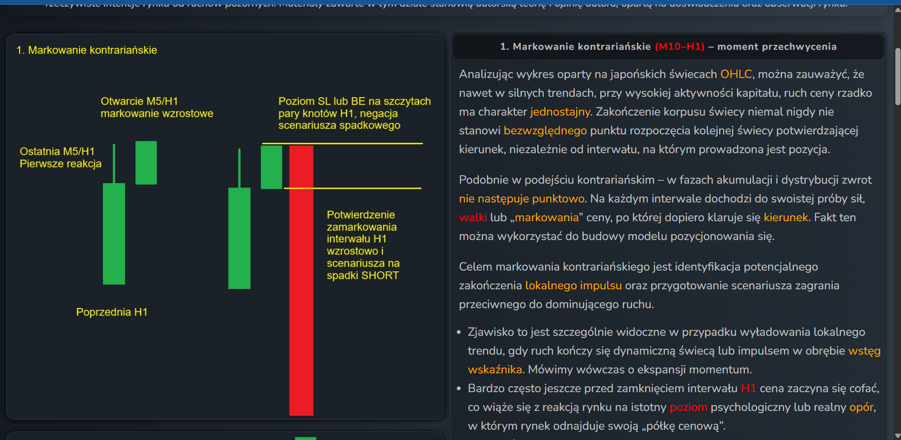
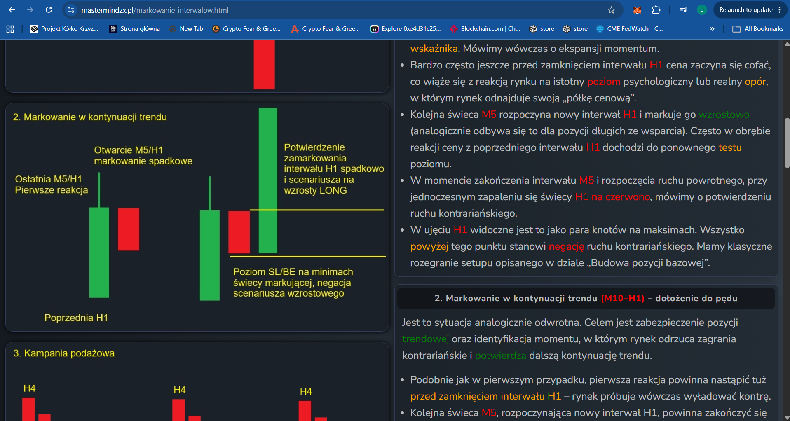
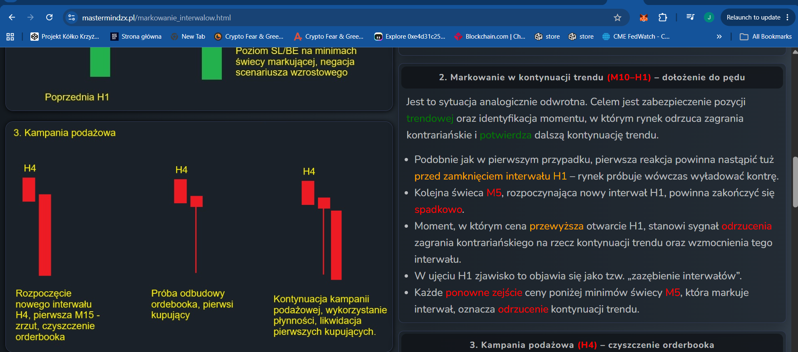
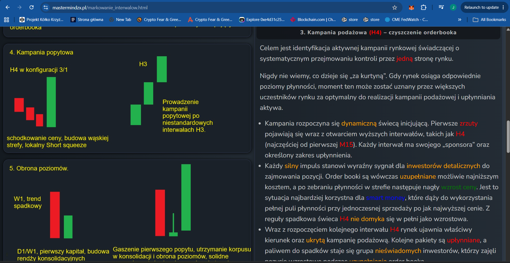
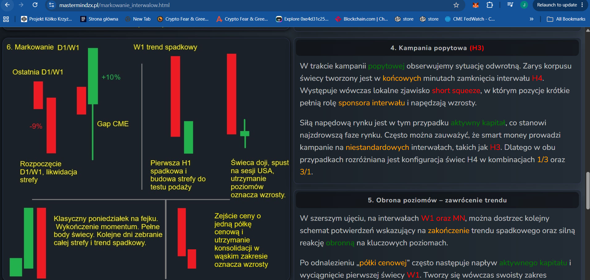
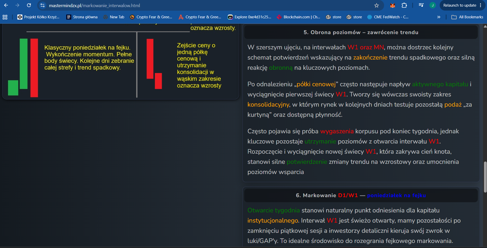
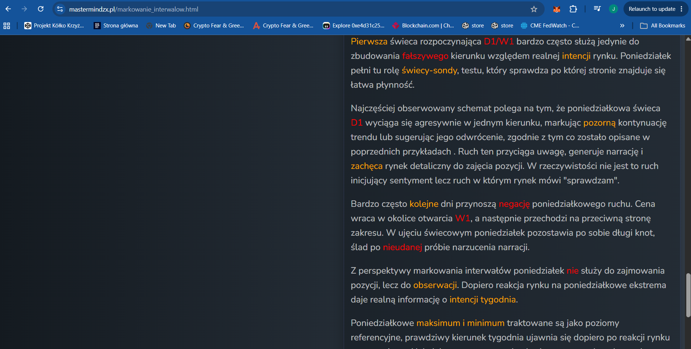

# MMS — Markowanie interwałów (Interval marking)

**Source:** Mastermind ZX (mastermindzx.pl/markowanie_interwalow.html) —
MMS-BTC/XAU/NQ Mean-Reversion Contrarian Strategy v.4.
**Extracted:** 2026-07-11 (full-tab screenshots in `raw/`). The tab is framed by the
author as his own market theory/opinion based on experience and observation.
**Relevance to algo_bot:** HIGH — scheme 1 (contrarian marking) is the *source* of the
Beta `armed → reaction` entry proxy; the tab also defines the multi-interval context
(H4/W1/D1 schemes) that the algo deliberately does not model.

## Key rules (own words)

Six marking schemes, all built on one observation: direction changes are never
point-like — each interval opens with a "test of strength" (*marking*) that only later
resolves into direction.

1. **Contrarian marking (M10–H1) — the interception moment.** A local impulse
   discharges with a dynamic candle *inside the indicator bands* (momentum expansion).
   Often before the H1 even closes, price starts pulling back off a psychological /
   real level (the "price shelf"). The next M5/M10 candle *opens the new H1 interval
   and marks it in the reaction direction*; the H1 candle flipping color confirms the
   contrarian move. On the H1 chart this prints as a **pair of wicks at the extreme**;
   everything beyond that wick-pair is the **negation** of the contrarian scenario —
   hence SL (or BE) belongs at the wick-pair extreme. This is the exact mechanics
   behind the base-position setup from tab 01.
2. **Marking in trend continuation (M10–H1).** Mirror scheme protecting a trend
   position: the counter-reaction comes just before H1 close, the M5 opening the new
   H1 closes back in the trend direction, and price exceeding the H1 open = market
   *rejecting* the contrarian play ("interval interlock"). Re-descent below the
   marking-candle minima = rejection of trend continuation.
3. **Supply campaign (H4) — order-book cleaning.** A campaign of systematic control
   takeover by one side: dynamic initiating candle, dumps at the opening of higher
   intervals (H4, usually from its first M15), order books refilled cheaply, then
   liquidity used to sell high. The falling H4 usually does not fully reclaim as a
   rising candle; the *next* H4 reveals the hidden campaign.
4. **Demand campaign (H3).** Reverse case: the candle body forms in the final minutes
   of the H4 close, driven by a local short squeeze (shorts are the "interval
   sponsor"). Smart money runs campaigns on non-standard intervals (H3) — hence the
   H4 candle configurations distinguished as **1/3 vs 3/1**.
5. **Level defence (W1/MN) — trend reversal.** After the price shelf is found: active
   capital inflow pulls the first W1 candle, a consolidation range forms and tests
   remaining supply; a new W1 candle covering the prior wick shadow = strong
   confirmation of the trend turn.
6. **D1/W1 marking — "Monday on a fake".** The week's first D1 candle is typically a
   *probe* building a false direction against real intent ("the market says: check").
   Following days negate the Monday move; Monday leaves a long wick. Monday is for
   observation, not positioning; its max/min become the week's reference levels, and
   the largest edge appears when the market turns against believers in the
   "move from the week's open". Key intraday hours: first H1 and its extinguishing,
   Europe open ~9:00, US session 15:30.
- **Smart money disclaimer (author's):** not a mythical whale — a hierarchical
  structure of aware investors/funds; cascading capital renders the market
  non-deterministic; only interests at different levels exploiting liquidity pools.

## Key parameters

| Parameter | MMS value | Note |
|---|---|---|
| Marking sub-interval | M5 / M10 within H1 | The reaction is *read on the sub-interval opening the new H1* |
| Contrarian SL/BE anchor | Wick-pair extreme of the H1 marking | Structural, not percentage |
| Campaign intervals | H4 (supply), H3 (demand), configurations 1/3 & 3/1 | Context filters, not entry signals |
| Macro confirmation | W1/MN level defence; D1/W1 Monday probe | Weekly reference levels |

## Screenshots

Caption: scheme 1 — M5/H1 upward marking after a downward impulse; SL/BE at the H1
wick-pair tops; color-flip of H1 = confirmation.

Caption: scheme 2 — mirror case; SL/BE at the marking candle's minima; "interval
interlock".

Caption: scheme 3 — order-book cleaning sequence on H4 (dump → rebuild → continuation).

Caption (04-08): schemes 4-6 — H3 demand campaigns and H4 1/3 / 3/1 configurations;
W1 level-defence; the Monday-probe pattern with key session hours; the author's smart
money framing.

## Alignment relevance

- **Scheme 1 is what Beta's `armed → reaction` approximates.** MMS reads the reaction
  on the M5/M10 candle *opening the new H1*; Beta (no intrabar data) proxies this with
  two H1 bars: wick-touch arms, next bar's body direction is the reaction. Match:
  **PARTIAL — documented Beta Decision 1** (M5 sub-bar marking explicitly out of
  scope). Consequence: Beta's entry is up to one H1 bar *later* than the MMS manual
  entry — a conservative lag, worth revisiting only if MR-Session 2 shows edge decay
  attributable to entry timing.
- **SL placement divergence.** MMS scheme 1 anchors SL/BE at the *wick-pair extreme*
  (structural negation level; base position separately keeps the 2% full SL from tab
  01). Beta implements only the fixed 2% SL. Match: **PARTIAL** — Beta chose the
  simpler, unambiguous rule from tab 01; the structural wick-pair SL belongs to the
  add-on layer (tab 02) which is deferred.
- **Multi-interval context (H4/H3/W1/D1 schemes 3-6): not modelled** in Beta — they
  are discretionary context filters. If a regime filter is ever added, this tab is the
  economic prior for it. Match: **N (out of scope, by design)**.
