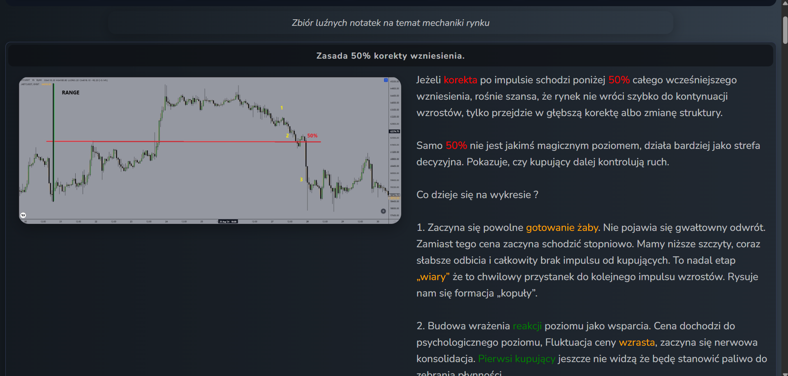
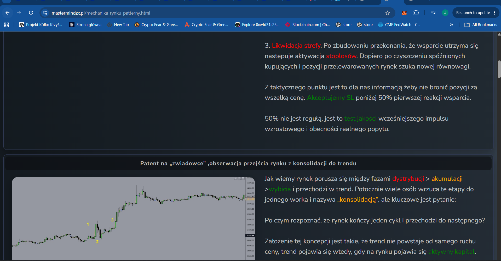
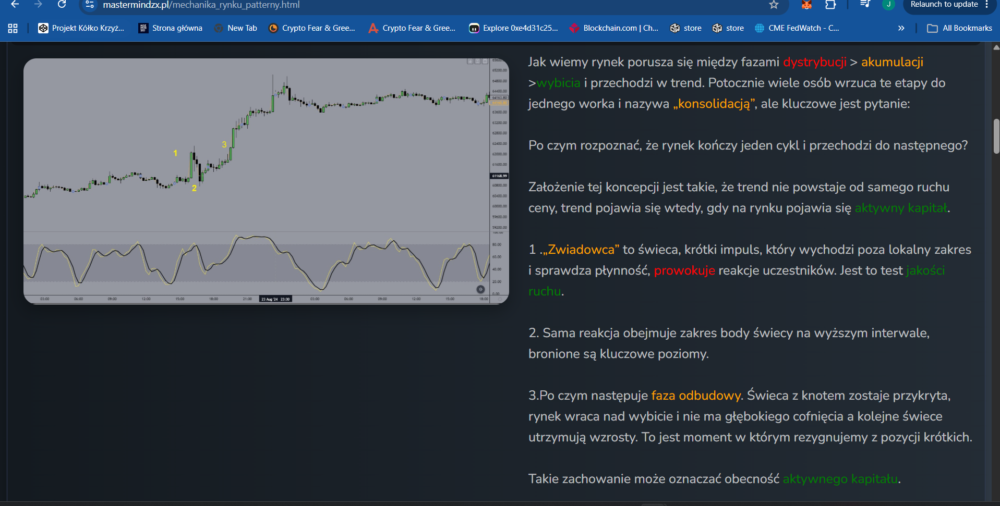
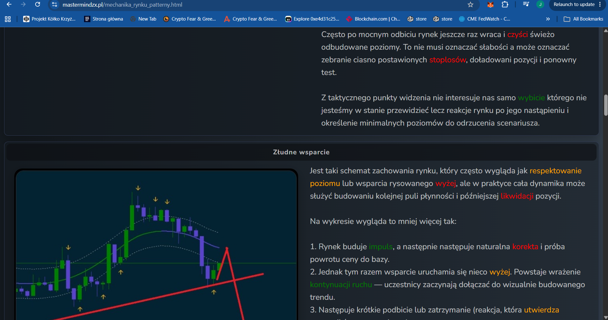
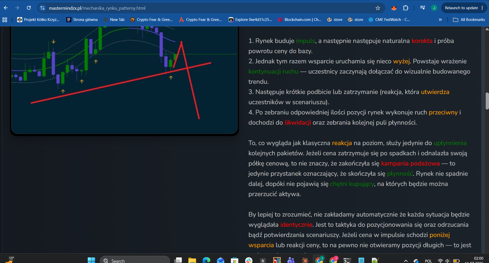
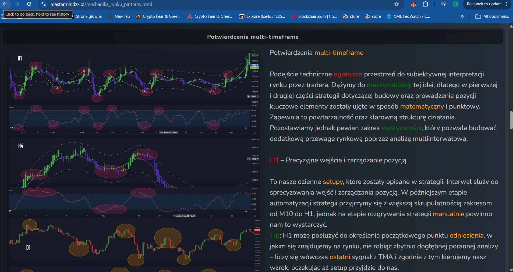
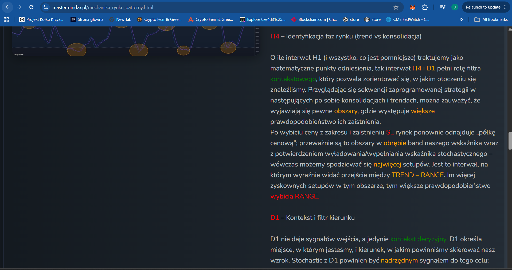
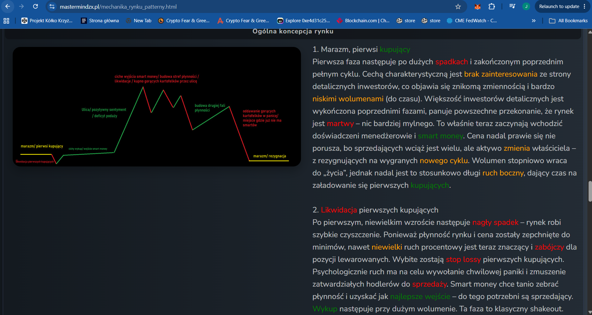
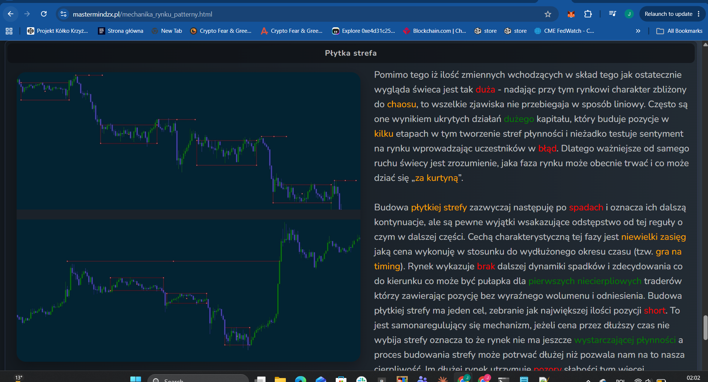

# MMS — Mechanika rynku, patterny (Market mechanics, patterns)

**Source:** Mastermind ZX (mastermindzx.pl/mechanika_rynku_patterny.html) — "a loose
collection of notes on market mechanics" (author's own framing).
**Extracted:** 2026-07-11. **Priority: MEDIUM** — discretionary context, no direct
mechanics for `mean_reversion_bb_stoch`; captions only.

## Screenshots

Caption: 50%-retracement rule — a correction below 50% of the prior upswing signals a
deeper correction / structure change; 50% is a decision *zone*, not a magic level.
Stages: "gotowanie żaby" (slow boil — lower highs, weaker bounces, "kopuła" dome
forms), building the impression of support, then zone liquidation (stop-loss sweep).

Caption: tactical takeaway — don't defend positions at all cost; accept the SL below
50% of the first support reaction. "Zwiadowca" (scout candle): a short impulse beyond
the local range that tests liquidity and provokes reactions — a quality test of the
move.

Caption: scout → reaction spans the higher-interval candle body (key levels defended)
→ rebuild phase (wick candle covered, no deep pullback) = the moment to abandon
counter-trend shorts; signature of active capital.

Caption: illusory support — what looks like level respect is liquidity building for a
later liquidation (impulse → correction → support "one shelf higher" → short squeeze →
reversal). After breakdown + SL the market re-finds its price shelf, usually within
the indicator bands with Stochastic discharge confirmation.

Caption: the multi-interval layer above the mathematical H1 core: **H1** = precise
entries and position management (daily setups; M10-H1 range to be parametrized in the
algo stage); **H4/D1** = context filter (trend vs consolidation; most setups where
price is inside the bands + Stochastic discharge; TREND↔RANGE transition zones);
**D1** = no entry signals, decision context only — **D1 Stochastic as the
superordinate direction signal**.

Caption: full cycle narrative: stagnation/first buyers → shakeout (liquidation of
first buyers) → street euphoria/supply deficit → quiet smart-money exit → second
liquidity wave → panic distribution → stagnation/resignation.

Caption: shallow zone — small price range over extended time after declines ("gra na
timing"); usually continuation, purpose = collecting shorts; self-regulating: no
breakout = not enough liquidity yet.

## Alignment relevance (brief)

Context-only tab. Two hooks worth remembering for future MR iterations: (a) H4/D1 as
a regime filter prior (trend vs range) if the bare core needs one post-Sweep; (b) D1
Stochastic as a superordinate direction filter — a candidate `entry_mode` extension,
*not* part of the Beta scope.
