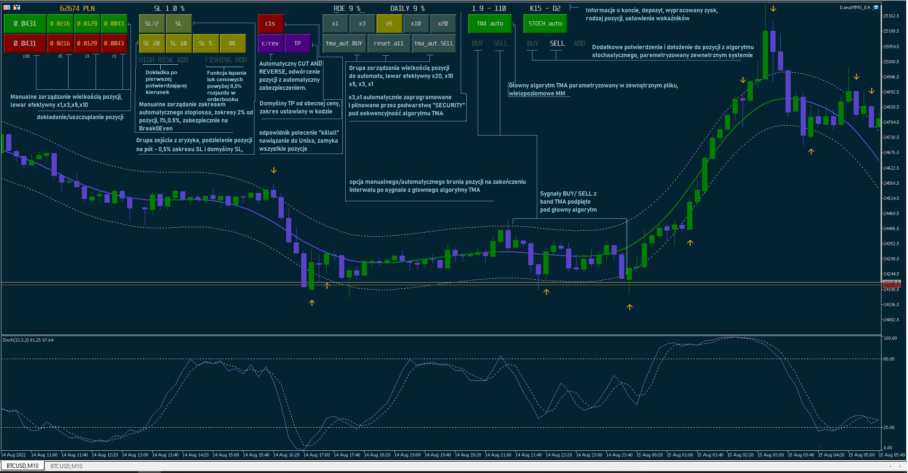
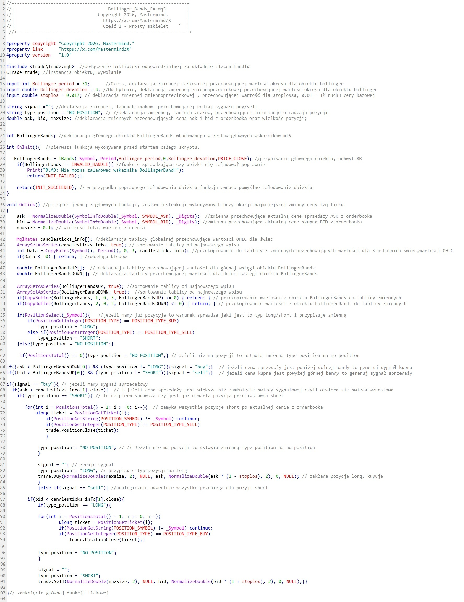
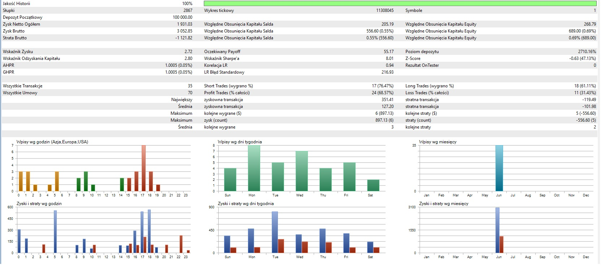

# MMS — Algotrading Semi-automatic

**Source:** Mastermind ZX (mastermindzx.pl) — MMS-BTC/XAU/NQ Mean-Reversion Contrarian
Strategy v.4. **Extracted:** 2026-07-11. **Priority: MEDIUM** — captions only; shows
how the author himself mechanizes the methodology (MT5 EA), useful as a sanity anchor
for our own parametrization choices.

## Screenshots

Caption: the author's MT5 semi-automatic EA ("IcarusMMS_EA") on **BTCUSD M10** with an
annotated control panel: manual size management x1/x3/x5/x10/x20 (add/trim), automatic
SL management (**2% from position, 1%, 0.5%, BreakEven**; "SL/2" de-risking = halve
position at 0.5% SL range), HIGH-RISK ADD (add-on after the first confirming candle)
and FISHING ROD (catching price-gap wicks >0.5% above orderbook), automatic
CUT-AND-REVERSE, default TP from current price (range set in code), kill-all button,
**TMA.auto as the main algorithm** (parametrized from an external file, multi-level
MM, x3/x1 guarded by a "SECURITY" sub-layer under the TMA sequencing) and
**STOCH.auto** as additional confirmations/add-on (parametrized externally); BUY/SELL
signals from the TMA bands wired to the main algorithm; **Stoch(13,3,3)** visible in
the sub-window.

Caption: educational MQL5 skeleton "Bollinger_Bands_EA.mq5, Część 1 — Prosty szkielet"
(© 2026 Mastermind): `iBands(period=31, deviation=3, PRICE_CLOSE)`, `stoplos=0.017`
(1.7% of base price), signal = ask below lower band → buy / bid above upper band →
sell, gated by the *previous candle close* (reaction confirmation), cut-and-reverse
(close all opposite positions first), `maxsize=0.1` lot. Notable: band **touch +
next-candle confirmation + %SL** — structurally the same core as our
`mean_reversion_bb_stoch`, and the author's own BB parametrization here (31/3.0/1.7%)
differs from the "standard" 20/2.0/2% — evidence that he treats indicator settings as
free parametrization targets, not sacred defaults.

Caption: MT5 tester report (one month, June; 100% history quality, 2 867 M10 bars,
tick-level 11.3M): net +1 931 on 100 000 deposit, 35 trades / 70 deals, profit factor
2.72, recovery factor 2.80, **Sharpe 8.01** (MT5 convention), max balance DD 0.55%,
win rate: shorts 76.5% / longs 61.1%, profit trades 68.6%, avg win 127.20 vs avg loss
-101.98, max 6 consecutive wins / 5 consecutive losses; session histograms peak at
17:00-18:00 (US session). Author's own benchmark for the semi-auto variant — n=35 on
one month, so indicative only.

## Alignment relevance (brief)

Three anchors for us: (a) the author's *own* mechanization gates entries on the
previous-candle reaction — confirming Beta's armed→reaction reading; (b) his EA uses
BB(31, 3.0) + SL 1.7% — supports sweeping `bb_window`/`bb_num_std`/`sl_pct` rather than
freezing 20/2.0/2%; (c) TMA.auto + STOCH.auto split (main algo vs add-on confirmations)
mirrors the tab-02 finding that Stochastic's native role is the add-on layer.
